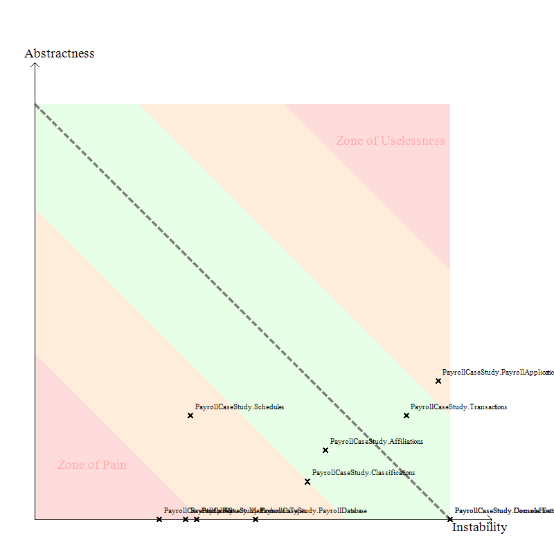
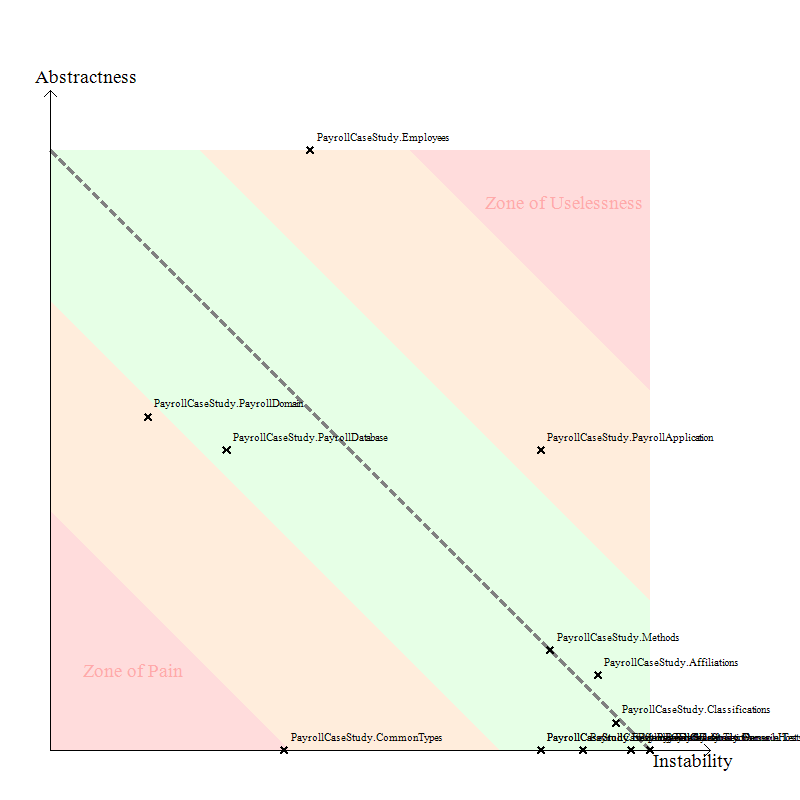
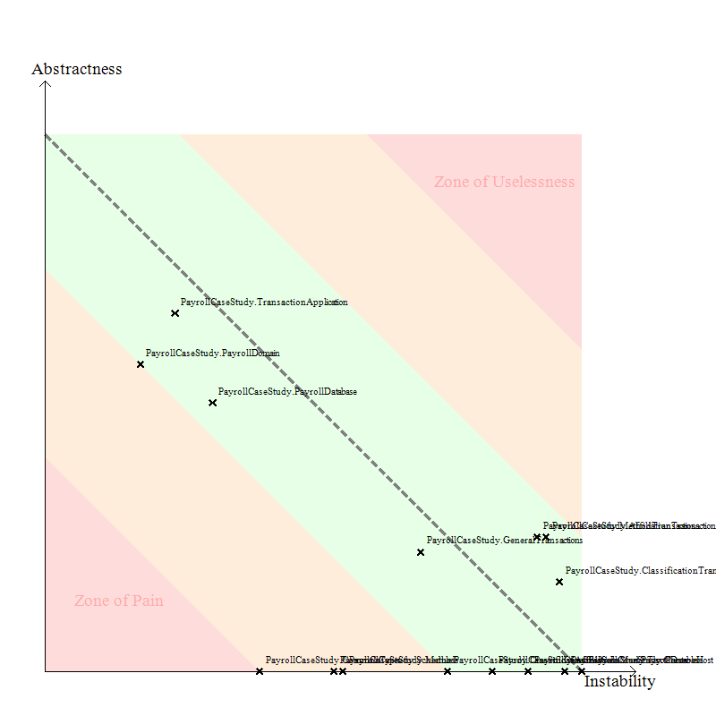
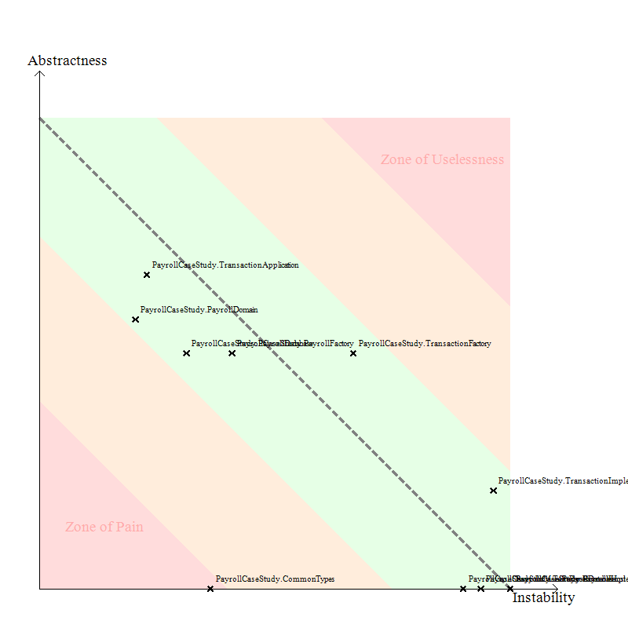

# PPP Payroll Case Study
This is a C# implementation of the Payroll Case Study from Uncle Bob's book [Agile Software Development - Principles, Patterns, and Practices](http://www.amazon.com/Software-Development-Principles-Patterns-Practices/dp/0135974445).
It's based on the original book (not the C# one), though I'm interested how the two implementations compare.

## Releases
* Section 3: [All code and tests](https://github.com/FreekPaans/PPPPayrollCaseStudy/tree/done-with-section-3)
* Chapter 22: [Packaged by conceptual relation (Figure 22-1)](https://github.com/FreekPaans/PPPPayrollCaseStudy/tree/package-by-conceptual-relation)
* Chapter 22: [Packaged by Closed Hierarchy (Figure 22-2)](https://github.com/FreekPaans/PPPPayrollCaseStudy/tree/package-by-closed-hierarchy)
* Chapter 22: [Packaged by REP (Figure 22-3)](https://github.com/FreekPaans/PPPPayrollCaseStudy/tree/packaged-by-rep)
* Chapter 22: [Final packaging (Figure 22-11)](https://github.com/FreekPaans/PPPPayrollCaseStudy/tree/package-final)

## Wishlist
* Real database implementation
* Acceptance tests
* Web frontend

## Package strategies

### Packaged by conceptual relation
This is from figure 22-1 on page 276. [Source](https://github.com/FreekPaans/PPPPayrollCaseStudy/tree/package-by-conceptual-relation).

Abstractness vs instability:

### Packaged by common closure principle
This is from figure 22-2 on page 277. [Source](https://github.com/FreekPaans/PPPPayrollCaseStudy/tree/package-by-closed-hierarchy).

Abstractness vs instability:

### Packaged by REP
This is from figure 22-3 on page 280. [Source](https://github.com/FreekPaans/PPPPayrollCaseStudy/tree/packaged-by-rep).

Abstractness vs instability:

### Final packaging in book
This is from figure 22-11 on page 289. [Source](https://github.com/FreekPaans/PPPPayrollCaseStudy/tree/package-final).

Abstractness vs instability:

